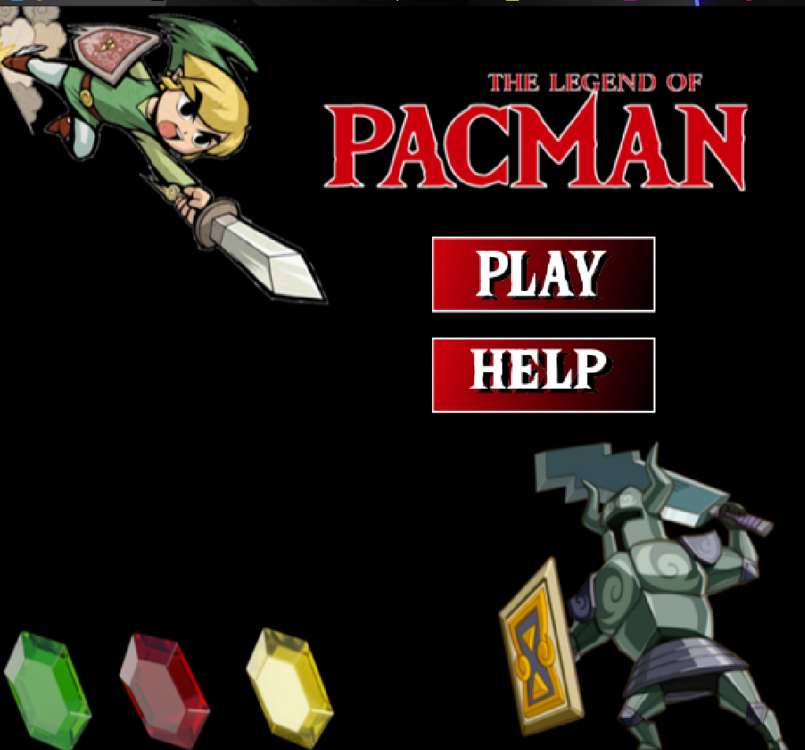
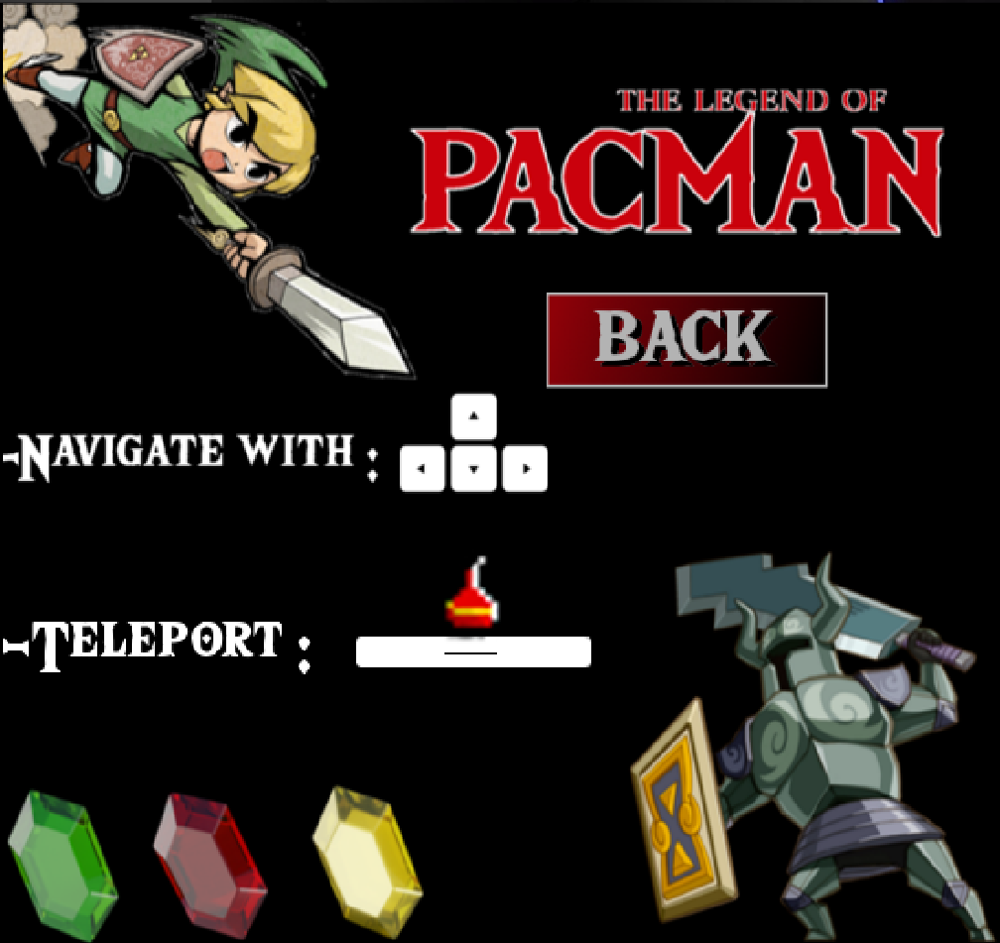
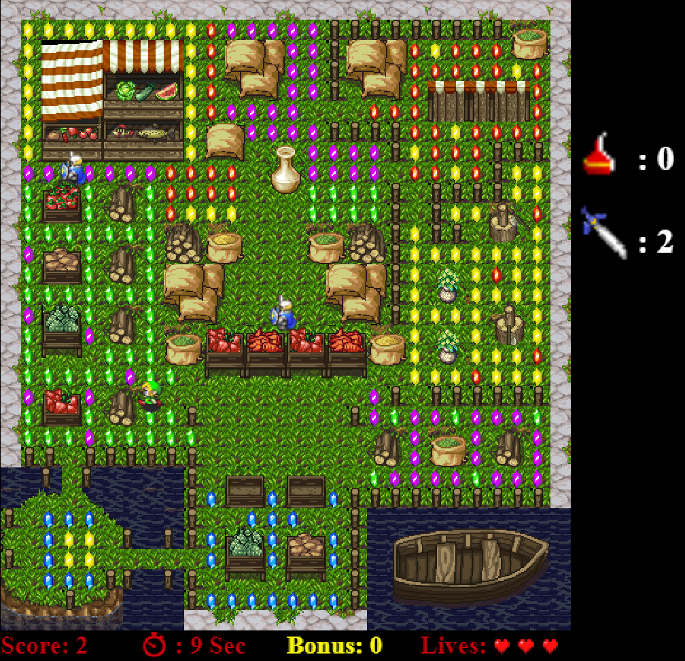
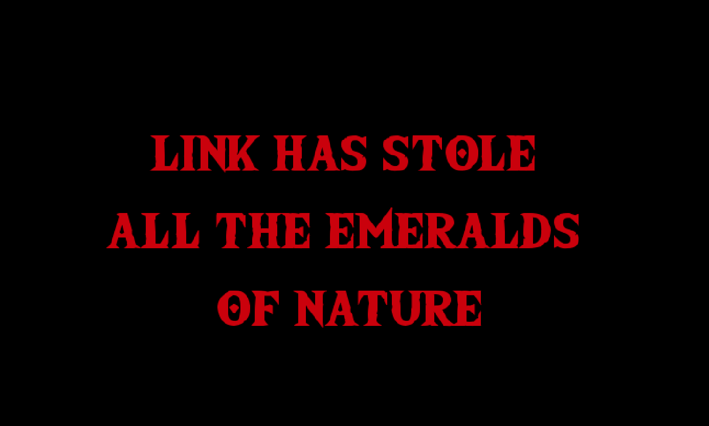
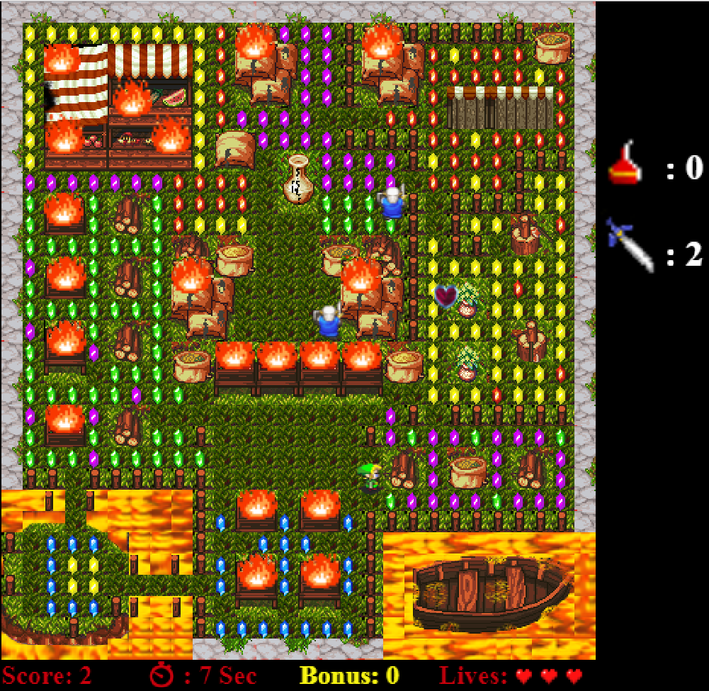
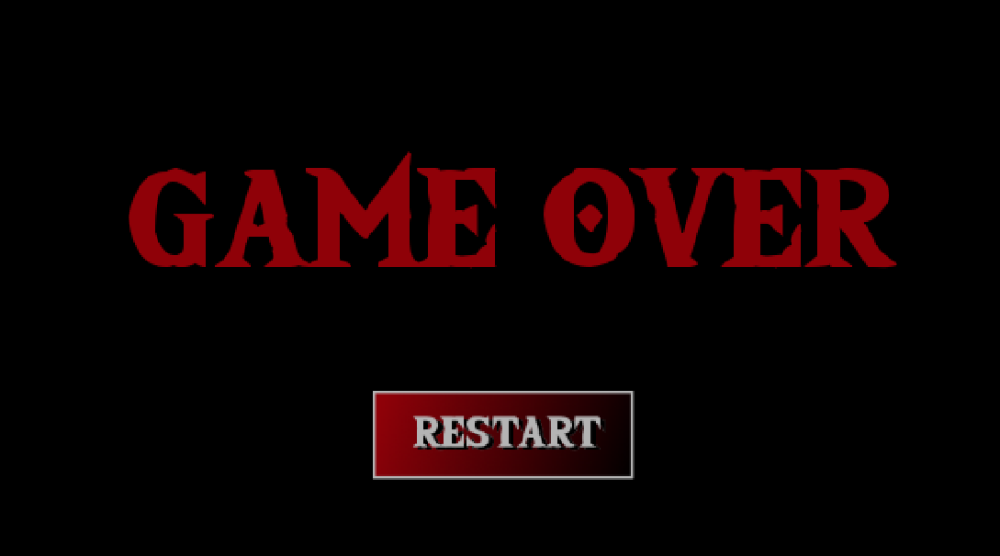

## ΣΤΟΙΧΕΙΑ ΦΟΙΤΗΤΗ

```markdown
ΟΝΟΜΑΤΕΠΩΝΥΜΟ: Τασιόπουλος Εμμανουήλ
ΑΡΙΘΜΟΣ ΜΗΤΡΩΟΥ: Π2015046
```

## ΕΙΣΑΓΩΓΗ
  Σε αυτό το εξάμηνο κλιθήκαμε να δημιουργήσουμε ένα arcade game βασισμένο στους μηχανισμούς και τα physics από άλλα διάσημα βιντεοπαιχνίδια. Το παιχνίδι το οποίο χρησιμοποιήθηκε για τη δημιουργία του The Legend Of Pacman είναι φυσικά το γνωστό σε όλους μας packman .Στη συγκεκριμένη υλοποίηση κύριος χαρακτήρας είναι ο Link από τη σειρά The Legend Of Zelda. Σκοπός του είναι να συλλέξει όσα περισσότερα emeralds μπορεί αποφεύγοντας τους αντίπαλους του. Φυσικά δεν τον αφήνουμε μονό του μιας και στο παιχνίδι έχουν προστεθεί διάφορα items τα οποία τον βοηθούν να ολοκληρώσει το στόχο του

## ΣΥΝΟΨΗ
  
   - __Δημιουργία νέου χάρτη με καινούργιο tileset__   
   - __Αλλαγή του χαρακτήρα τον Link απο το κλασικό παιχνίδι "Legend Of Zelda"__ 
   - __Προσθήκη animation όταν ο χαρακτήρας κινείται προς οποιαδήποτε κατευθυνση__ 
   - __Αλλαγη των Dots που θα μαζευει ο χαρακτηρας__
   - __Προσθήκη Bonus__
   - __Προσθήκη ηχου__
   - __Προσθήκη Score Board__
   - __Προσθήκη Εχθρών__
   - __Προσθήκη weapon__
   - __Προσθήκη αντικειμένουν για teleport__
   - __Προσθήκη Splash Screens__
     
## ΕΠΙΛΟΓΗ ΕΡΓΑΛΕΙΩΝ
  Τα εργαλεια τα οποια χρησιμοποιηθηκαν ειναι τα εξης: 
  
  - __TILED__
  
  ```markdown  
   Προγραμμα επεξεργασιας tileset για τη δημιουργια του χαρτη      
   ```
  - __BRACKETS__
  
  ```markdown  
  IDE για τη συγγραφη του κωδικα
  ```
  - __PHOTOSHOP__
  
  ```markdown
  Προγραμμα επεξεργασιας εικονων για τη σχεδιαση των γραφικων στοιχειων 
  ```  
  - __PHASER LIBRARY__
  
  ```markdown
  Βηβλιοθικη αναπτυξης παιχνιδιων σε HTML5   
  ```  
   
## ΔΙΑΔΙΚΑΣΙΑ ΑΝΑΠΤΥΞΗΣ

### ΓΙΑ ΤΟ ΔΕΥΤΕΡΟ ΠΑΡΑΔΟΤΕΟ

- __Δημιουργία νέου χάρτη με καινούργιο tileset το οποιο τροποποιηθηκε στο photoshop προκειμενου να καλυπτει τις αναγκες του παραδοτεου__

- __Αλλαγή του χαρακτήρα "Pacman" με τον χαρακτήρα Link απο το κλασικό παιχνίδι "Legend Of Zelda"__ 

- __Προσθήκη animation όταν ο χαρακτήρας κινείται προς οποιαδήποτε κατευθυνση__
 
- __Αλλαγη των Dots που θα μαζευει ο χαρακτηρας__

- __Προσθήκη Bonus:__
   
```markdown
   με τη μορφή χρυσού μήλου 
   εμφανίζεται και εξαφανίζεται σε τυχαίες περιοχές του χάρτη
   Το bonus ισοδυναμεί με 50 πόντους που προστίθενται στο τελικό Score
```    
- __Προσθήκη ηχου__ 

```markdown
    8-bit ηχος για theme sound απο το σχετικό παιχνίδι "Legend Of Zelda"
    Sound effect καθε φορα που ο παικτης συλλεγει ενα bonus
```    
- __Προσθήκη Score Board για την εμφάνιση:__

```markdown
    Score
    Χρόνου
    Bonus
    Ζωές     
 ```  
- __Εμφάνιση μηνύματος με τα αποτελέσματα και επαναφορά παιχνιδιου:__   

### ΓΙΑ ΤΟ ΤΡΙΤΟ ΠΑΡΑΔΟΤΕΟ

- __Αλλαγη των Dots που θα μαζεύει ο χαρακτήρας προκειμένου να θυμίζει περισσότερο το παιχνίδι στο οποίο βασίστηκα__

- __Προσθήκη Εχθρών__

```markdown
    Με δικό τους AI που κινούνται τυχαία στο χάρτη
    Εντοπίζουν το collision και προσαρμόζουν την κίνησή τους
```  

- __Αλλαγή του χαρακτήρα οταν πεθαίνει__

```markdown
    Διαφορετικό sprite 
    ανάλογα με την κατεύθινση που πεθαίνει ο παίκτης
```     
- __Προσθήκη weapon__ 

```markdown
   Εμφανίζεται ανα 100 score + bonus
   Υπάρχουν μονο 2 διαθέσιμα
   Μόλις σκοτωθεί ένας εχθρός εξαφανίζεται
```

 - __Προσθήκη αντικειμένουν για teleport__ 
 
 ```markdown
    Εμφανίζεται ανα 10 score + bonus
    προσθέτονται και μπορούν να χρησιμοποιηθούν μαζί
    εμφανίζονται συνεχώς
    ενεργοποιείται με το space  
 ```  
 - __Προσθήκη Side Screen__
 
 ```markdown
   Εμφανιζει τα διαθεσιμα swords
   Εμφανιζει τα διαθεσιμα potions
 ```  
   
  - __Προσθήκη Splash Screens__
  
  ```markdown
   Main Menu
   Help Screen
   Game Over
  ```  
### ΓΙΑ ΤΟ ΤΕΤΑΡΤΟ ΠΑΡΑΔΟΤΕΟ

- __Δημιουργία καινουργιας πιστας στην οποια μεταβαίνει ο χρήστης όταν συλλέξει όλα τα emeralds της πρώτης πίστας__

- __Προσθήκη επιπλέον Splash Screens__

```markdown
 Στην αλλαγή πίστας
 Στον τερματισμό του παιχνιδιού
``` 
- __Προσθήκη επιπλέον ήχων__

```markdown
Game Over
Win Screen
In Game Sounds
```
## ΕΝΔΕΙΚΤΙΚΕΣ ΟΘΟΝΕΣ








## ΣΥΜΠΕΡΑΣΜΑΤΑ
Με την ολοκληρωση του τετρατου παραδοτεου ολοκληρωνεται και η εργασια στα πολυμεσα του Ε εξαμηνου.Ολη αυτη η διαδικασια ηταν μια πολυ καλη ευκερεια προκειμενου να εξοικηωθουμε με εργαλεια οπως ειναι η βηβλιοθηκη phaser αλλα και να επεκτεινουμε τις γνωσεις μας σε οτι αφορα το gaming development.

